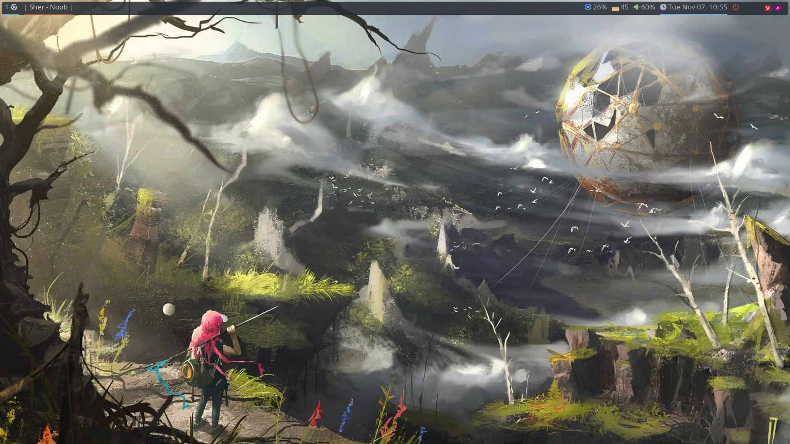
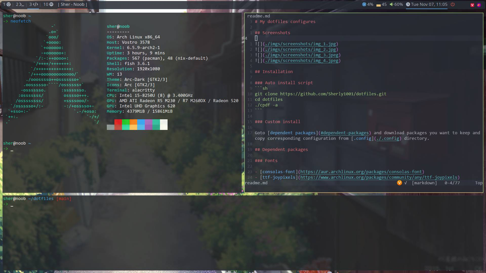
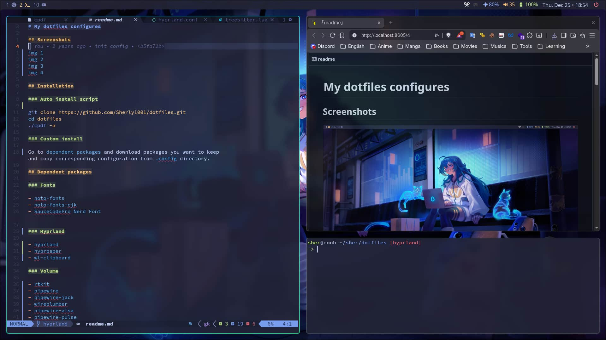
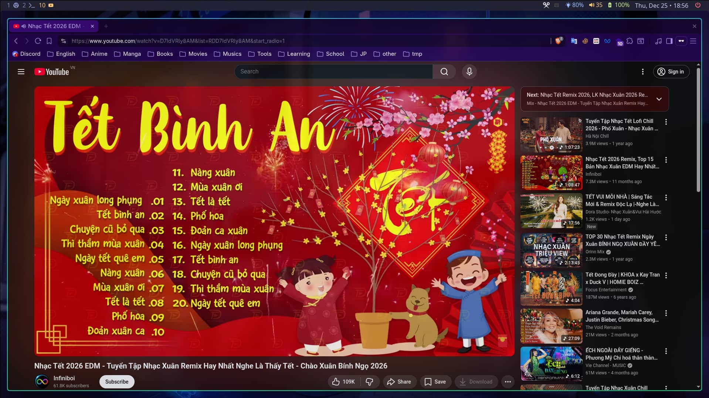

# My dotfiles configures

## Screenshots






## Installation

### Auto install script
```sh
git clone https://github.com/Sherly1001/dotfiles.git
cd dotfiles
./cpdf -a
```

### Custom install

Goto [dependent packages](#dependent-packages) and download packages you want to keep and copy corresponding configuration from [.config](./.config) directory.

## Dependent packages

### Fonts

- [noto-fonts](https://www.archlinux.org/packages/extra/any/noto-fonts)
- [noto-fonts-cjk](https://www.archlinux.org/packages/extra/any/noto-fonts-cjk)
- [SauceCodePro Nerd Font](https://github.com/ryanoasis/nerd-fonts/releases/download/v3.4.0/SourceCodePro.tar.xz)

### Picom

Install [picom-ftlabs-git](https://aur.archlinux.org/packages/picom-ftlabs-git) from aur.

### Volume

- [alsa-utils](https://archlinux.org/packages/extra/x86_64/alsa-utils/)
- [alsa-plugins](https://archlinux.org/packages/extra/x86_64/alsa-plugins/)
- [pulseaudio-alsa](https://archlinux.org/packages/extra/x86_64/pulseaudio-alsa/)
- [pavucontrol](https://archlinux.org/packages/extra/x86_64/pavucontrol/)

Start the PulseAudio daemon

```
pulseaudio --start
```

_Optional_ Install [sox](https://archlinux.org/packages/extra/x86_64/sox/) to play sound when adjusting volume

### Polybar

- [polybar](https://archlinux.org/packages/extra/x86_64/polybar/)
- [inotify-tools](https://archlinux.org/packages/extra/x86_64/inotify-tools/) to check brightness changes

### Other tools

- [alacritty](https://wiki.archlinux.org/title/Alacritty) - terminal
- [numlockx](https://archlinux.org/packages/extra/x86_64/numlockx/) - auto turn numlock on
- [copyq](https://archlinux.org/packages/extra/x86_64/copyq/) - clipboard history
- [feh](https://wiki.archlinux.org/title/feh) - background settings
- [flameshot](https://wiki.archlinux.org/title/Flameshot) - take screenshots
- [dunst](https://wiki.archlinux.org/title/Dunst) - notification daemons
- [rofi](https://wiki.archlinux.org/title/Rofi) - application launcher
- [yad](https://archlinux.org/packages/extra/x86_64/yad/) - show polybar calendar
